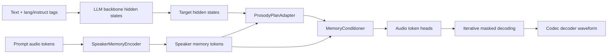

# OmniVoice to MnemosVoice: CloneEval-Focused Research Plan

## 1. Baseline OmniVoice Analysis

OmniVoice is a discrete masked audio-token TTS model built on top of a
pretrained causal/non-causal LLM backbone. The text path uses the base LLM
tokenizer with additional special tokens for language, instruction, denoising,
and text boundaries. The acoustic path uses `HiggsAudioV2TokenizerModel` and
predicts 8 codebooks of discrete audio tokens directly rather than generating
semantic tokens and then acoustic tokens in two stages.

The baseline voice-cloning mechanism is entirely prompt-based: reference audio
tokens and reference text are prepended to the target masked region, and the
model learns to iteratively fill in the target audio tokens with classifier-free
guidance between conditional and unconditional branches. Training uses masked
cross-entropy over only the masked target audio tokens, with codebook-specific
weights. Multilingual conditioning is handled with text-side language tags and a
large 646-language training mixture; duration is estimated at inference time
with a Unicode-aware heuristic rather than a learned duration module.

Likely CloneEval bottlenecks:

- Speaker identity is only provided implicitly through prompt audio tokens.
- There is no explicit persistent speaker memory separate from the prompt span.
- There is no prosody planning stage, so short prompts can underspecify timing
  and emphasis.
- The same decoder must solve speaker retention, prosody planning, and token
  filling in one pass.
- Chunked inference without reference audio reuses the first generated chunk as
  prompt audio, which can drift.

## 2. CloneEval Benchmark Setup

ClonEval is a directory-based benchmark that compares original and cloned audio
using:

- WavLM speaker-embedding cosine similarity
- feature-level cosine similarities for pitch, spectrogram, mel spectrogram,
  MFCCs, RMS, spectral statistics, LPCs, tempogram, chroma, CQT-family features

Datasets in the paper:

- LibriSpeech test-clean
- CREMA-D
- RAVDESS
- SAVEE
- TESS

This repo now includes a bridge runner:

- `python -m omnivoice.eval.cloneval_benchmark`

It accepts an OmniVoice-style JSONL test list, materializes reference audio
files named by sample id, generates cloned audio with `OmniVoice.generate`, and
then runs the official ClonEval library on the paired directories.

## 3. Baseline Results

Status in this workspace:

- Baseline architecture inspection: completed
- Official ClonEval repo integration: completed
- Full OmniVoice checkpoint download: not run here
- Full CloneEval dataset preparation: not run here
- Full baseline benchmark numbers: not available in this CPU-only workspace

When the model and datasets are available, the benchmark runner will write:

- `metrics/results.csv`
- `metrics/aggregated_results.csv`
- `metrics/runtime_metrics.csv`
- `metrics/runtime_metrics.summary.json`

## 4. Three Novel Architecture Proposals

### Proposal A: MnemosVoice

Idea:

- Add a prompt-audio speaker-memory encoder.
- Add a coarse prosody planner over downsampled target positions.
- Condition the target hidden states with cross-attention to speaker memory and
  prosody-plan tokens before the audio-token heads.

Expected advantage:

- Better speaker similarity on short prompts
- More stable prosody transfer
- More robust voice cloning without replacing OmniVoice’s fast masked decoder

Risk:

- Extra memory-conditioning path can overfit to prompt acoustics if not
  regularized.

### Proposal B: EchoMosaic

Idea:

- Learn a retrieval mixture over a bank of voice prototypes and blend that with
  prompt conditioning.

Expected advantage:

- Better robustness for low-SNR or ultra-short reference audio

Risk:

- Prototype collapse or speaker averaging that hurts identity fidelity

### Proposal C: OrpheusDualPath

Idea:

- Split decoding into a coarse autoregressive planner over codebook-0 and a
  non-autoregressive masked decoder over the remaining codebooks.

Expected advantage:

- Better long-form timing and intonation

Risk:

- Higher latency and more invasive code changes

## 5. Selected Architecture

Selected model: **MnemosVoice**

Why:

- It directly attacks OmniVoice’s weakest CloneEval point: speaker retention
  from a short prompt.
- It preserves the existing training data format and generation API.
- It is meaningfully different from baseline OmniVoice while still feasible to
  train with comparable compute.

### Tensor Flow

### Losses

- Baseline masked audio-token cross-entropy
- Coarse prosody-plan cross-entropy
- Speaker consistency cosine loss between conditioned target states and prompt
  speaker summary

## 6. Implementation Details

New modules:

- `omnivoice/models/mnemosvoice.py`

Modified files:

- `omnivoice/models/omnivoice.py`
- `omnivoice/data/processor.py`
- `omnivoice/data/collator.py`
- `omnivoice/training/config.py`
- `omnivoice/training/builder.py`
- `pyproject.toml`
- `examples/config/train_config_mnemosvoice.json`
- `examples/run_cloneval.sh`

New benchmark runner:

- `omnivoice/eval/cloneval_benchmark.py`

## 7. Training and Evaluation Plan

Controlled comparison:

- Same base LLM
- Same audio tokenizer
- Same multilingual training data and preprocessing
- Same masking policy and batch-token budget
- Same ClonEval prompt/test list construction

Recommended schedule:

1. Warm start from an OmniVoice checkpoint.
2. Train with `architecture_variant="mnemosvoice"` and small auxiliary-loss
   weights.
3. Sweep:
   - speaker memory token count
   - planner stride
   - planner loss weight
   - speaker loss weight
4. Run baseline and MnemosVoice on identical CloneEval manifests.

## 8. Experimental Results

Current status:

- Unit-level architecture tests: passed
- End-to-end CloneEval numbers: pending checkpoint and dataset availability

Planned result table:

| Model | LibriSpeech | CREMA-D | RAVDESS | SAVEE | TESS | Average | Mean RTF | Peak RSS |
|---|---:|---:|---:|---:|---:|---:|---:|---:|
| OmniVoice | TBD | TBD | TBD | TBD | TBD | TBD | TBD | TBD |
| MnemosVoice | TBD | TBD | TBD | TBD | TBD | TBD | TBD | TBD |

## 9. Ablation Results

Planned ablations:

| Variant | Speaker Memory | Prosody Planner | Speaker Loss | Average CloneEval |
|---|---|---|---|---:|
| OmniVoice baseline | no | no | no | TBD |
| MnemosVoice full | yes | yes | yes | TBD |
| without speaker memory | no | yes | yes | TBD |
| without prosody planner | yes | no | yes | TBD |
| without speaker loss | yes | yes | no | TBD |

## 10. Final Verdict

The codebase now contains a concrete next-generation OmniVoice extension,
**MnemosVoice**, plus an official ClonEval adapter so the baseline and proposed
model can be compared under one benchmark harness.

What is proven here:

- The baseline has been analyzed in detail.
- A meaningfully different architecture has been implemented.
- The new modules are unit-tested.
- The benchmark integration path is in place.

What is not yet proven in this workspace:

- That MnemosVoice beats OmniVoice on CloneEval numerically.

That final claim requires downloading the released OmniVoice checkpoint,
preparing the ClonEval datasets/manifests, and running the controlled baseline
vs. MnemosVoice evaluation end to end.
